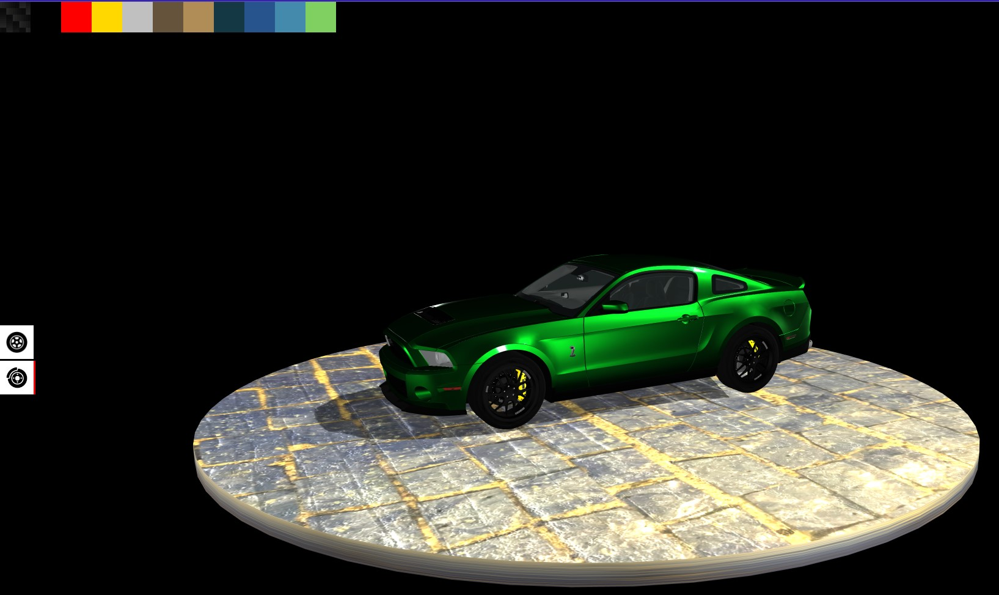

# Interactive Mustang Model

[](https://threejs.org/)
[](https://threejs.org/docs/#examples/en/loaders/GLTFLoader)

A 3D interactive Ford Mustang Shelby 2012 model customizer built using Three.js and GLTFLoader. The application allows users to change the colors and textures of the brake calipers and wheels. The Mustang model was taken from [Sketchfab](https://sketchfab.com/3d-models/ford-mustang-shelby-2012-b60b3a520c024fd69416d56a71900626).

## Demo Link

Access the app at https://interactive-mustang.wozniakkamil.com

## Table of Contents

- [Features](#features)
- [Screenshots](#screenshots)
- [Installation](#installation)
- [Usage](#usage)
- [Customization](#customization)

## Features

- Interactive 3D Ford Mustang Shelby 2012 model.
- Change the colors and textures of brake calipers and wheels.
- Add custom colors and textures.
- User-friendly interface with intuitive controls.
- Fully responsive design.

## Screenshots



## Installation

To get started, clone the repository and install the dependencies:

```bash
git clone https://github.com/WoXuS/threejs-interactive-car
cd threejs-interactive-car
npm install
```

## Usage

To start the development server, run:

```bash
npm run dev
```

Open http://localhost:5173 to view the Mustang customizer in your browser.

## Customization

To add custom colors or textures, modify the colors.js file in the root folder. Add a new array to the colors object, and include the color's hex value. For textures, you should add the path and a size property. To both the color and texture you can additionally add the shininess.

```javascript
export const colors = [
  {
    // carbon fiber
    texture: "/images/carbon.png",
    size: [2, 2, 2],
    shininess: 60,
  },
  {
    // black
    color: "00000",
    shininess: 10,
  },
  // add more colors here
];
```
